# The Dirty Old Pub

[Link to live project](https://braxxian.github.io/The-Auld-Pub/)

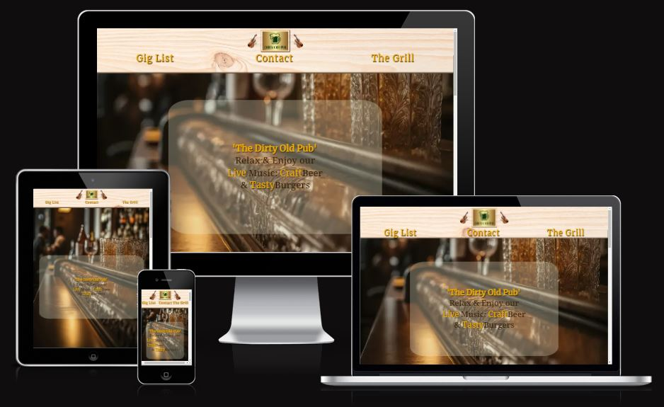

## Table of contents
(To be populated later)

## Planning & Development

### External user goals

* Find a good pub with live music & food
* Be informed of musical events & dates
* Plan a night out

### Site owner goals

* Attract customers to our pub
* Provide information about events
* Establish a 'ONELegend' Brand of superior quality burgers

### User Stories

* As a user I want to be able to access and read the
  site across all my devices
* As a user I want to find evening entertainment
* As a user I want to know what food and drink is
  available      
* As a user I want to be given an idea about the pub 
  environment & it's location

### Features

* The site has been built to be fully responsive.
* The images and colours used reflect the ambience of
the pub, giving the user a good feel for the environment
* The header clearly navigates the site and responds to user interaction
* Clicking or tapping the Logo zooms back to the home page
* Clicking or tapping the 'gigs','contact' & 'grill' takes the user to the relevant page

* Parallax scrolling ensures a pleasing experience to the user
* The footer gives links to all our social media pages
* The site gives clear information about musical events and the food on offer
* The site offer a sign up to a newsletter with a 'call to action' button
* The site provides clear instruction on our location using an embedded google map

### Mock Up Pages

The original design ideas were created using [Draw.io](https://app.diagrams.net/)

The mock ups were created from a 'What sort of Pub would I like to visit'? perspective. And were freely adapted during development in an agile process based on user feedback.

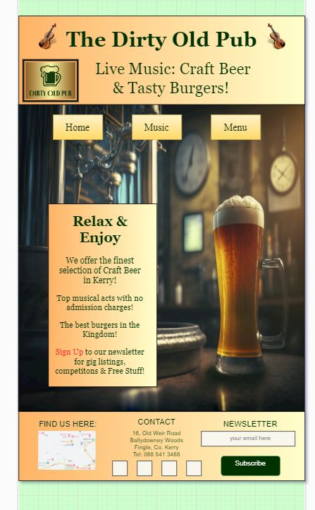    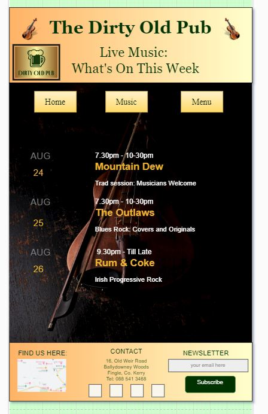
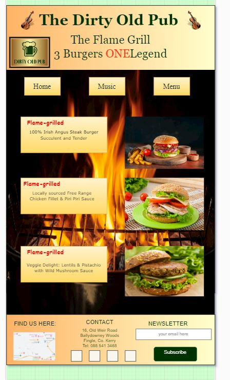

### Color Scheme

The colors used were primarily: #361e06, #EEB22F, #e61313 and antiquewhite. These were chosen to compliment the background images and provide a cohesive tone for the site

### Fonts

Fonts (other than stock web fonts) used were [Google Fonts](https://fonts.google.com) *' merriweather serif '* &
*' Noto serif '*

social media links were added using [Fontawesome](https://fontawesome.com/)

### Logo & Images

The dirty old Pub logo: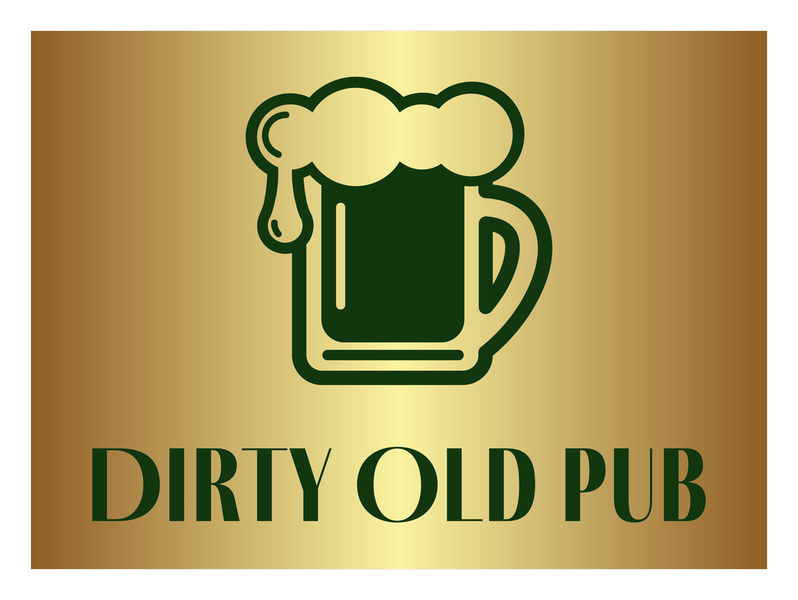
was created using [myfreelogomaker](https://www.myfreelogomaker.com)

All images used were taken from:-
* [Pexels.com](https://www.pexels.com)
* [Unsplash.com](https://unsplash.com)
* [Freepik.com](https://www.freepik.com)

## Future development

Looking forward, I would like to add a feature page, showcasing our range of craft beers and a gallery to allow site visitors to see highlights from past events

## Testing

###  Manual Testing

The site has been thoroughly tested for responsivity using chrome developer tools on screens ranging from the iphoneSE 375px to nesthub max 1280px:

*iphoneSE 375px*
*iphone 12 pro*
 

 *Samsung Galaxy S20 412px*
 *ipad air 820px*
 

*nesthub max 1280px*

The site was also tested on Google Chrome and Firefox web browsers.

There were numerous issues during development with pages not rendering correctly at different resolutions. These were resolved by adding media queries to the css stylesheet.

### HTML Validation

[W3C Markup Validation Service](https://validator.w3.org/) was used for HTML error checking:
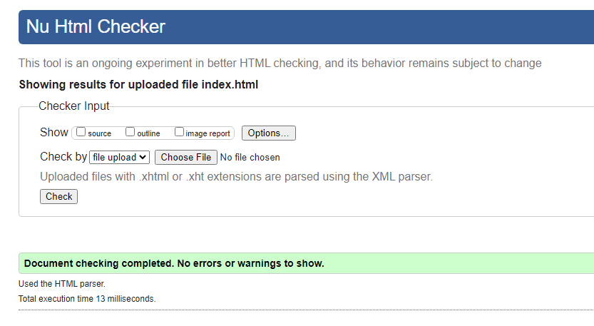

### CSS Validation
[Jigsaw](https://jigsaw.w3.org/css-validator/) was used for CSS error checking
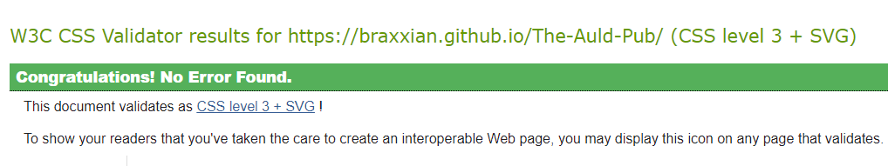

### Lighthouse

The lighthouse tool in chrome developer tools was used to check for:
 * performance
 * accessibility
 * best practices
 * seo

 Initially 'performance' on mobile devices was under performing at 74, this issue was fixed using [TinyPNG](https://tinypng.com/) to resize all images. This vastly improved the performance benchmark.
 

lighthouse mobile:
 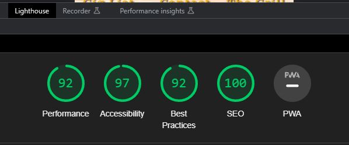

lighthouse desktop
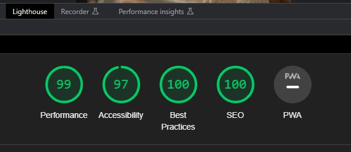

## Bugs

There is an issue on very small screens: The Galaxy fold 280px fails to display full width, resulting in a vertical line of exposure to the body alongside the scroll bar:
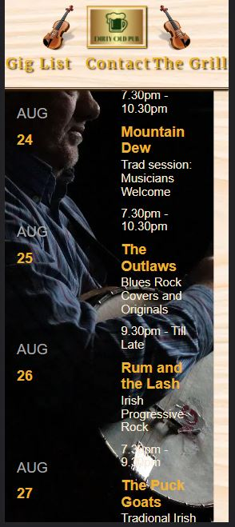

### Technologies Used:

All code was written using: [Visual Studio Code](https://code.visualstudio.com/)

Version Control: [Git](https://git-scm.com/)

Repository and Deployment: [Github](https://github.com/)

Image Editing: [Faststone](https://www.faststone.org/)

## Deployment

To deploy the github repository to gitpages:

1. Open your repository in Github and click on settings (top-right)

1. Select Pages from the left-hand bar 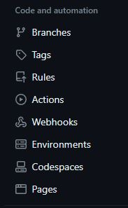

1. Select Deploy from branch, main, /root and click save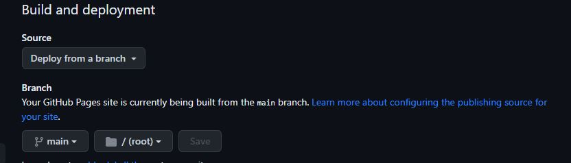

1. Wait a moment, when the site is deployed, you can see the URL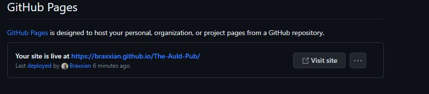

### Credits

Thanks to:
My code institute mentor, Oluwafemi Medale, for his support and suggestions.

Julia Wagner for posting her readme on Slack, which as a first time writer of a readme, proved most helpful as a template for mine.

Thanks also to fellow students Oleksy Lazarenko & Hennadii for there
encouragement & support

Also credit goes to [De Barra's Folk Pub](https://debarra.ie/) for inspiring the presentation of my music listings

